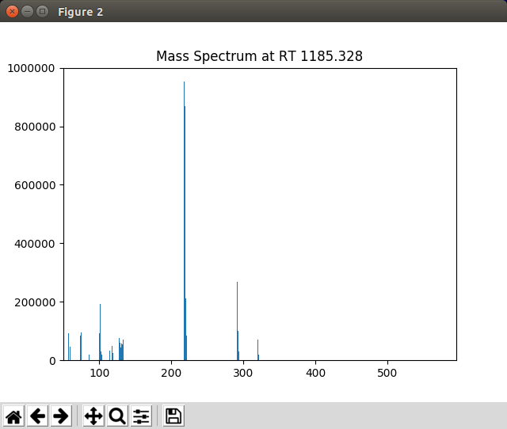

.. include:: ../demo_rst/Display_User_Interaction.rst

	The mass spectrum displayed by PyMassSpec-Plot when a peak in the graphics window is right clicked

To zoom in on a portion of the plot, select the |magnifier| button,
hold down the left mouse button while dragging a rectangle over the area of interest.
To return to the original view, click on the |home| button.

The |cross| button allows panning across the zoomed plot.

.. note::

	This example is in ``demo/jupyter/Display_User_Interaction.ipynb`` and
	``demo/scripts/Display_User_Interaction.py``.
