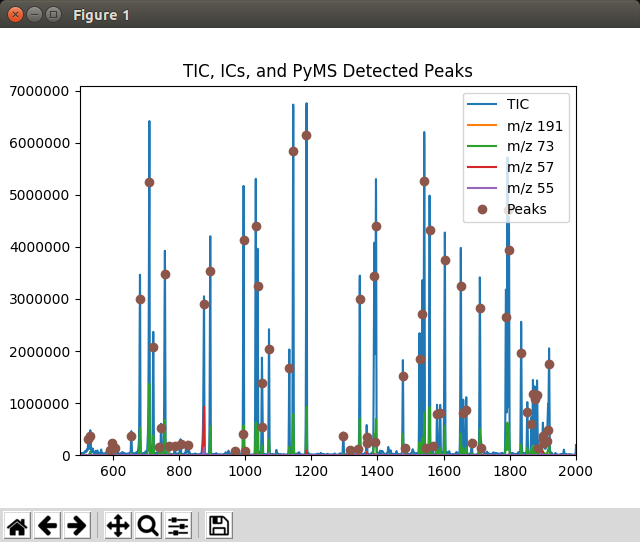

.. include:: ../demo_rst/Displaying_Detected_Peaks.rst

The function :func:`pyms.Peak.List.IO.store_peaks` can be used to store the peaks,
which can be loaded back with :func:`pyms.Peak.List.IO.load_peaks` for later display.

When not running in Jupyter Notebook,
the plot may appear in a separate window looking like this:

	Graphics window displayed by the ``Displaying_Detected_Peaks.py`` script

.. note:: This example is in ``demo/jupyter/Displaying_Detected_Peaks.ipynb`` and ``demo/scripts/Displaying_Detected_Peaks.py``.
