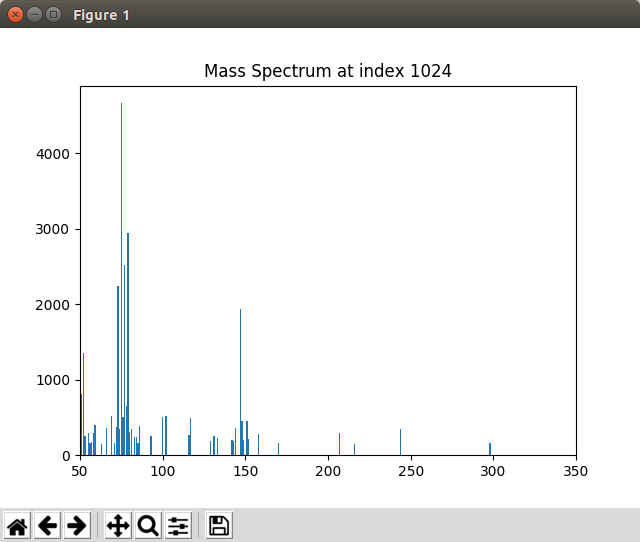

.. include:: ../demo_rst/Displaying_Mass_Spec.rst

When not running in Jupyter Notebook, the spectrum may appear in a separate window looking like this:

	Graphics window displayed by the ``Displaying_Mass_Spec.py`` script

.. note:: This example is in ``demo/jupyter/Displaying_Mass_Spec.ipynb`` and ``demo/scripts/Displaying_Mass_Spec.py``.
