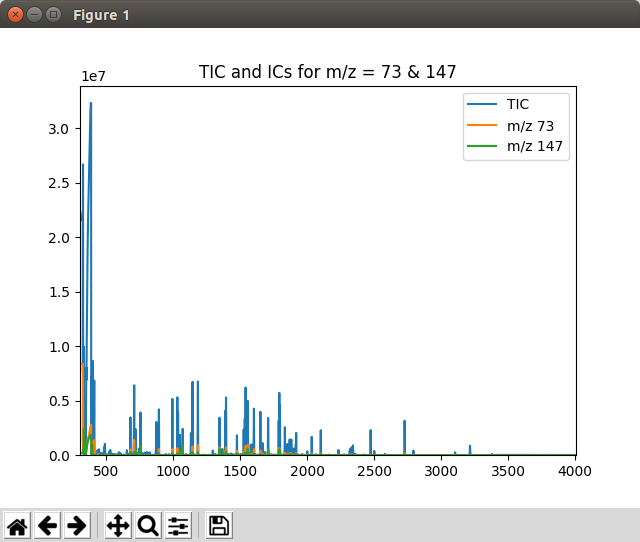

.. include:: ../demo_rst/Displaying_Multiple_IC.rst

When not running in Jupyter Notebook, the plot may appear in a separate window looking like this:

	Graphics window displayed by the ``Displaying_Multiple_IC.py`` script

.. note:: This example is in ``demo/jupyter/Displaying_Multiple_IC.ipynb`` and ``demo/scripts/Displaying_Multiple_IC.py``.
