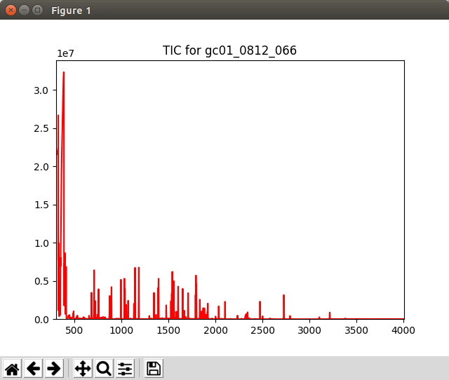

.. include:: ../demo_rst/Displaying_TIC.rst

When not running in a Jupyter Notebook, the plot may appear in a separate window looking like this:

	Graphics window displayed by the ``Displaying_TIC.py`` script

.. note:: This example is in ``demo/jupyter/Displaying_TIC.ipynb`` and ``demo/scripts/Displaying_TIC.py``.
